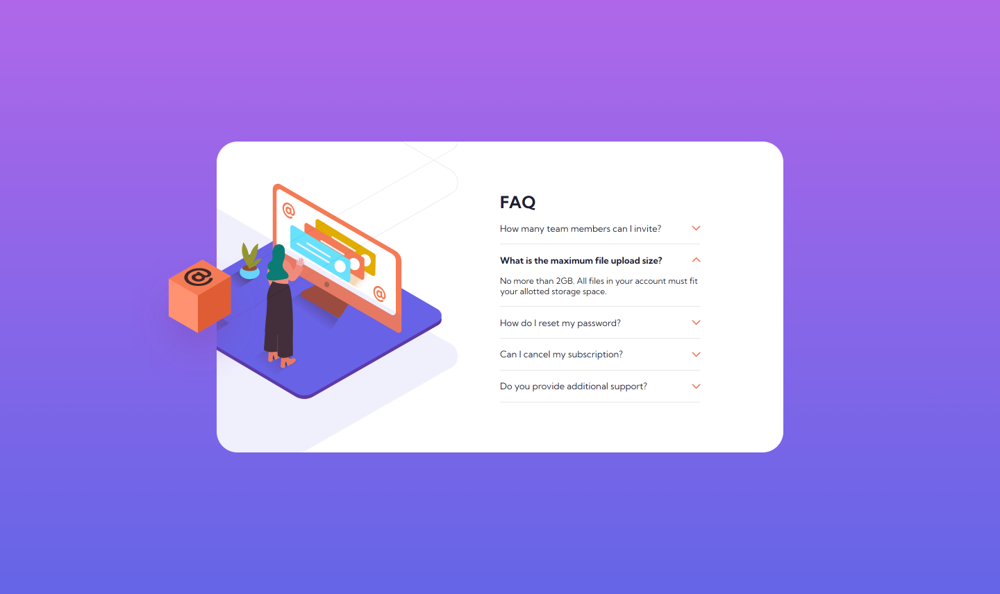
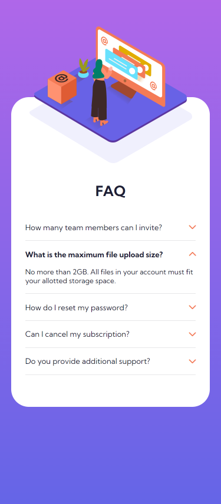

# FAQ-Accordion-Card

This is a solution to the [FAQ accordion card challenge on Frontend Mentor](https://www.frontendmentor.io/challenges/faq-accordion-card-XlyjD0Oam). Frontend Mentor challenges help you improve your coding skills by building realistic projects.

## Table of contents

-   [FAQ-Accordion-Card](#faq-accordion-card)
    -   [Table of contents](#table-of-contents)
    -   [Overview](#overview)
        -   [The challenge](#the-challenge)
        -   [Screenshot](#screenshot)
        -   [Links](#links)
    -   [My process](#my-process)
        -   [Built with](#built-with)
        -   [What I learned](#what-i-learned)
    -   [Author](#author)

## Overview

### The challenge

Users should be able to:

-   View the optimal layout for the component depending on their device's screen size
-   See hover states for all interactive elements on the page
-   Hide/Show the answer to a question when the question is clicked

### Screenshot




### Links

-   Solution URL: [Click here to view source code](https://github.com/ChinatuL/FAQ-Accordion-Card)
-   Live Site URL: [Click here to view live site](https://chinatul.github.io/FAQ-Accordion-Card/)

## My process

### Built with

-   Semantic HTML5 markup
-   CSS custom properties
-   Flexbox
-   Desktop-first workflow
-   Vanilla JavaScript
-   ES6 Standard

### What I learned

How to toggle aria-expanded value with JavaScript setAttribute function

```js
if (!question.classList.contains("show-answer")) {
    question.setAttribute("aria-expaned", "false");
    title.classList.remove("highlight-title");
} else {
    question.setAttribute("aria-expanded", "true");
    title.classList.add("highlight-title");
}
```

## Author

-   Frontend Mentor - [@ChinatuL](https://www.frontendmentor.io/profile/ChinatuL)
-   Twitter - [@ChinatuLucia](https://www.twitter.com/ChinatuLucia)
